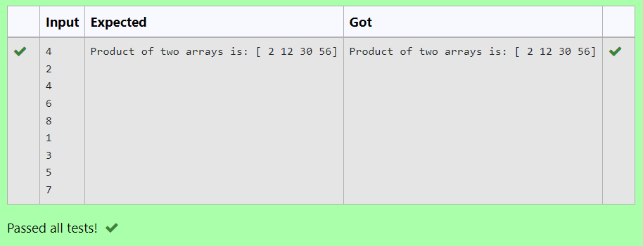

# Multiplying-two-matrix

## AIM: 
Write a python program to multiply two arrays using numpy
## ALGORITHM:

### Step 1:
Import numpy library using import statement.
### Step 2:
Create two lists and use input() method to find the number of elements to add in each list.
### Step 3:
Initiate a for loop and add elements to the list using input() and append() method.
### Step 4:
Create a 3rd list and append the product of each element in the first two lists as its elements.
### Step 5:
Convert the final 3rd list to an array using np.array() method and display the result.

## PROGRAM: 
~~~
'''
Program to multiply two arrays using numpy
Developed by: Kaushika.A
RegisterNumber: 21500112
'''

import numpy as np
n=int(input())
l1,l2=[],[]
for i in range (n):
        l1.append(int(input()))
for i in range (n):
        l2.append(int(input()))
arr=np.zeros((n))
l3=[]
for i in range (n):
    l3.append(l1[i]*l2[i])
arr=np.array(l3)
print("Product of two arrays is:",arr)
~~~

## OUTPUT:

## RESULT:
Thus the python program to multiply two arrays using numpy is successfully executed.

